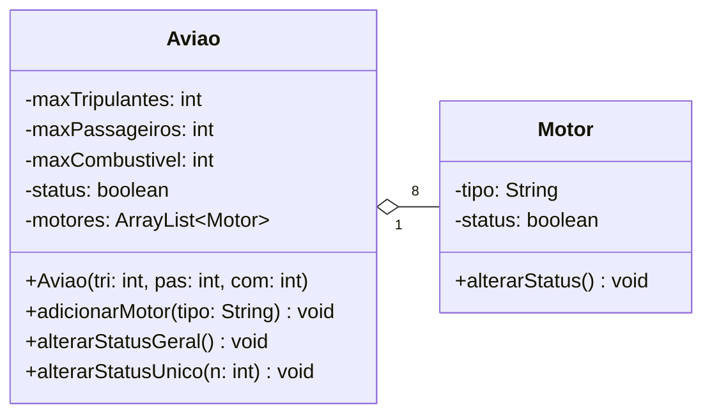

```mermaid
classDiagram
    direction LR
    
    class Aviao{
        -maxTripulantes: int
        -maxPassageiros: int
        -maxCombustivel: int
        -status: boolean
        -motores: ArrayList~Motor~
        +Aviao(tri: int, pas: int, com: int)
        +adicionarMotor(tipo: String) void
        +alterarStatusGeral() void
        +alterarStatusUnico(n: int) void
    }
    
    class Motor{
        -tipo: String
        -status: boolean
        +alterarStatus() void
    }
    
    Aviao "1" o-- "8" Motor
```