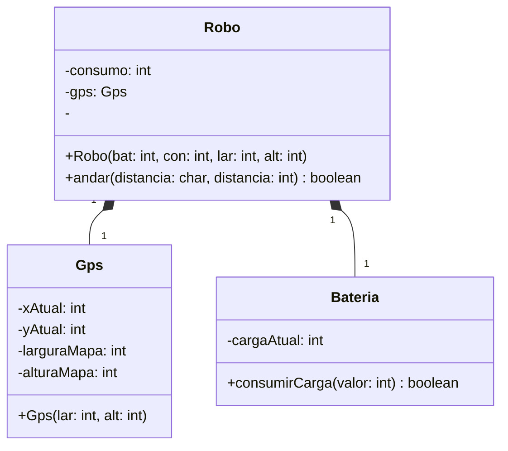

```mermaid
classDiagram
    
    
    
    class Robo {
        -consumo: int
        -gps: Gps
        -
        +Robo(bat: int, con: int, lar: int, alt: int)
        +andar(distancia: char, distancia: int)boolean
    }
    
    class Bateria {
        -cargaAtual: int
        +consumirCarga(valor: int)boolean
    }
    
    class Gps {
        -xAtual: int
        -yAtual: int
        -larguraMapa: int
        -alturaMapa: int
        +Gps(lar: int, alt: int)
    }
    
    Robo "1" *-- "1" Gps 
    Robo "1" *-- "1" Bateria
```