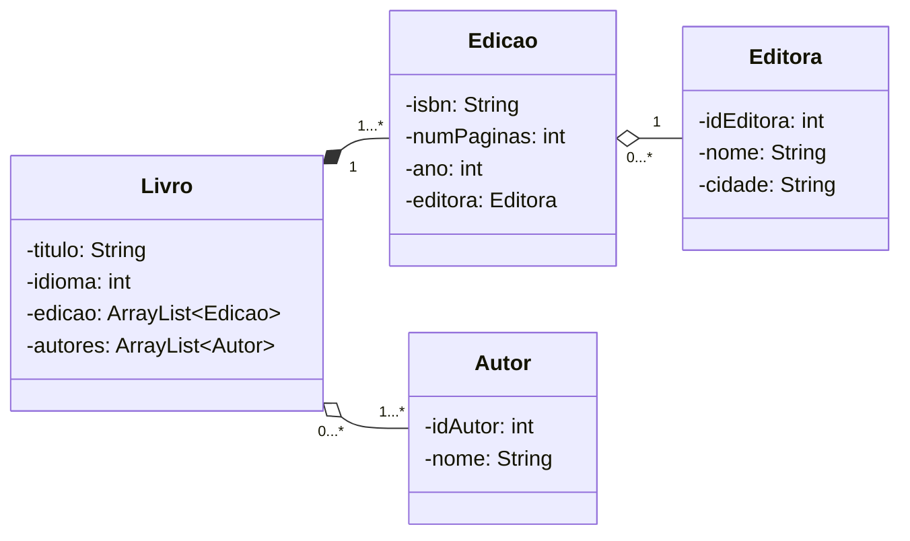
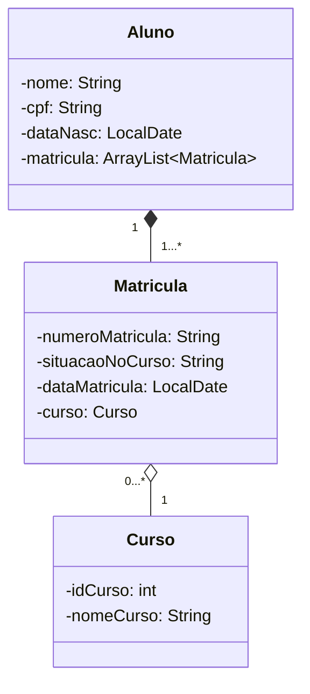

# Cadastro de Livros

```mermaid
classDiagram
    
    direction LR
    
    class Livro {
        -titulo: String
        -idioma: int
        -edicao: ArrayList~Edicao~
        -autores: ArrayList~Autor~
    }
    
    class Edicao {
        -isbn: String
        -numPaginas: int
        -ano: int
        -editora: Editora
    }
    
    class Editora {
        -idEditora: int
        -nome: String
        -cidade: String
    }
    
    class Autor{
        -idAutor: int
        -nome: String
    }
    Livro "1" *-- "1...*" Edicao
    Edicao "0...*" o-- "1" Editora
    Livro "0...*" o-- "1...*" Autor
    
```

# Registro de Estudantes 

```mermaid
classDiagram
    direction TB
    class Aluno {
        -nome: String
        -cpf: String
        -dataNasc: LocalDate
        -matricula: ArrayList~Matricula~
    }
    
    class Matricula {
        -numeroMatricula: String
        -situacaoNoCurso: String
        -dataMatricula: LocalDate
        -curso: Curso
    }
    
    class Curso {
        -idCurso: int
        -nomeCurso: String
    }
    
    Aluno "1" *-- "1...*" Matricula
    Matricula "0...*" o-- "1" Curso
```