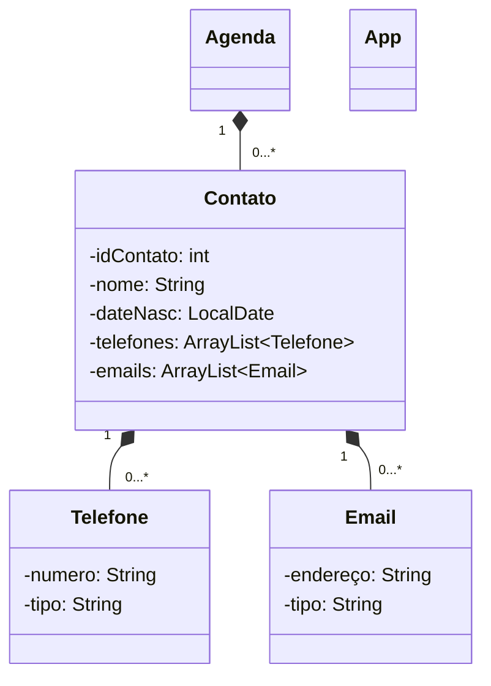

```mermaid
classDiagram
    class Contato {
        -idContato: int
        -nome: String
        -dateNasc: LocalDate
        -telefones: ArrayList~Telefone~
        -emails: ArrayList~Email~
    }
    
    class Telefone {
        -numero: String
        -tipo: String
    }
    
    class Email {
        -endereço: String
        -tipo: String
    }
    
    class Agenda {
        
    }
    
    class App {
        
    }
    
    Agenda "1" *-- "0...*" Contato
    Contato "1" *-- "0...*" Telefone
    Contato "1" *-- "0...*" Email
```