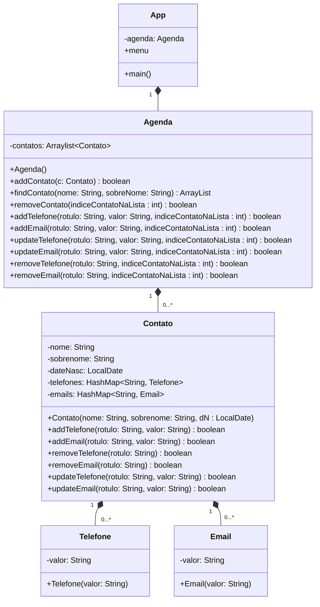

```mermaid
classDiagram
    class Contato {
        -nome: String
        -sobrenome: String
        -dateNasc: LocalDate
        -telefones: HashMap~String, Telefone~
        -emails: HashMap~String, Email~
        +Contato(nome: String, sobrenome: String, dN : LocalDate)
        +addTelefone(rotulo: String, valor: String) boolean
        +addEmail(rotulo: String, valor: String) boolean
        +removeTelefone(rotulo: String) boolean
        +removeEmail(rotulo: String) boolean
        +updateTelefone(rotulo: String, valor: String) boolean
        +updateEmail(rotulo: String, valor: String) boolean
    }
    
    class Telefone {
        -valor: String
        +Telefone(valor: String)
    }
    
    class Email {
        -valor: String
        +Email(valor: String)
    }
    
    class Agenda {
        -contatos: Arraylist~Contato~
        +Agenda()
        +addContato(c: Contato) boolean
        +findContato(nome: String, sobreNome: String) ArrayList<Contato>
        +removeContato(indiceContatoNaLista : int) boolean
        +addTelefone(rotulo: String, valor: String, indiceContatoNaLista : int) boolean
        +addEmail(rotulo: String, valor: String, indiceContatoNaLista : int) boolean
        +updateTelefone(rotulo: String, valor: String, indiceContatoNaLista : int) boolean
        +updateEmail(rotulo: String, valor: String, indiceContatoNaLista : int) boolean
        +removeTelefone(rotulo: String, indiceContatoNaLista : int) boolean
        +removeEmail(rotulo: String, indiceContatoNaLista : int) boolean
    }
    
    class App {
        -agenda: Agenda
        +main()
        +menu
    }
    App "1" *-- Agenda
    Agenda "1" *-- "0...*" Contato
    Contato "1" *-- "0...*" Telefone
    Contato "1" *-- "0...*" Email
```