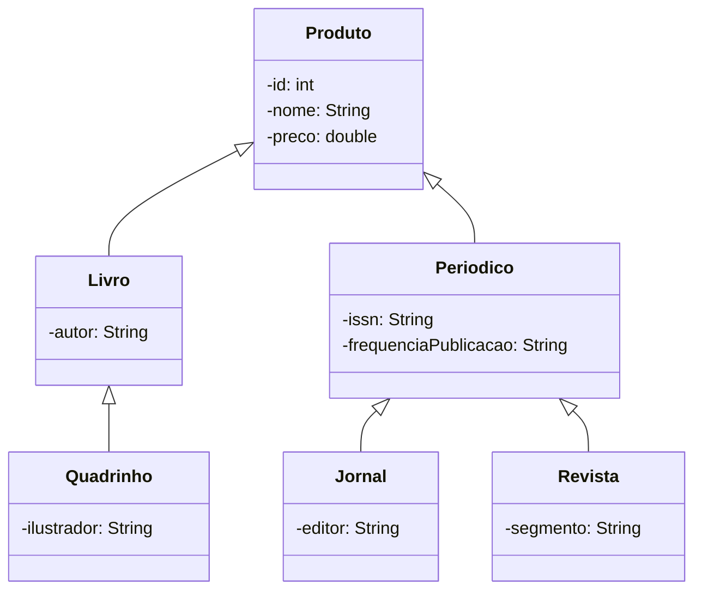
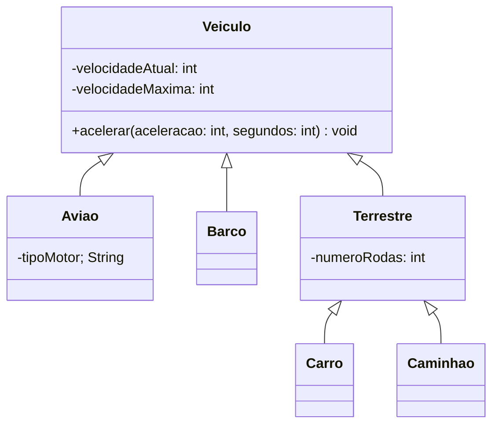

```mermaid
classDiagram
    
    class Produto {
        -id: int
        -nome: String
        -preco: double
    }
    
    class Livro {
        -autor: String
    }
    
    class Revista {
        -segmento: String
    }
    
    class Jornal {
        -editor: String
    }
    
    class Quadrinho {
        -ilustrador: String
    }
    
    class Periodico {
        -issn: String
        -frequenciaPublicacao: String
    }
    
    Produto |>-- Livro
    Livro |>-- Quadrinho
    
    Produto |>-- Periodico
    
    Periodico |>-- Jornal
    Periodico |>-- Revista
    
    
```

```mermaid
classDiagram
    
    class Carro {
        
    }
    
    class Aviao {
        -tipoMotor; String
    }
    
    class Barco {
        
    }
    
    class Caminhao {
        
    }
    
    class Terrestre {
        -numeroRodas: int
    }
    
    class Veiculo {
        -velocidadeAtual: int
        -velocidadeMaxima: int
        
        +acelerar(aceleracao: int, segundos: int)void
    }
    
    Terrestre |>-- Carro
    Terrestre |>-- Caminhao
    
    Veiculo |>-- Terrestre
    Veiculo |>-- Barco
    Veiculo |>-- Aviao
```