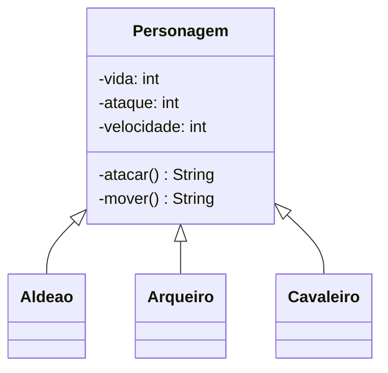

```mermaid
classDiagram
    
    class Personagem {
        -vida: int
        -ataque: int
        -velocidade: int
        
        -atacar()String
        -mover()String
    }
    
    class Aldeao {
        
    }
    
    class Arqueiro {
        
    }
    
    class Cavaleiro {
        
    }
    
    Personagem |>-- Aldeao
    Personagem |>-- Arqueiro
    Personagem |>-- Cavaleiro
```