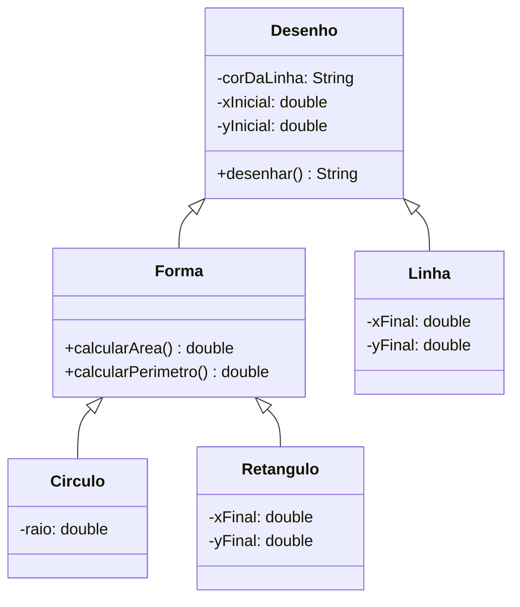

```mermaid
classDiagram
    direction TB
    
    class Desenho {
        -corDaLinha: String
        -xInicial: double
        -yInicial: double
        +desenhar() String
    }
    
    class Forma {
        +calcularArea()double
        +calcularPerimetro()double
    }
    
    class Linha {
        -xFinal: double
        -yFinal: double
    }
    
    class Circulo {
        -raio: double
    }
    
    class Retangulo {
        -xFinal: double
        -yFinal: double
    }
    
    Desenho |>-- Linha
    Desenho |>-- Forma
    Forma |>-- Circulo
    Forma |>-- Retangulo
```