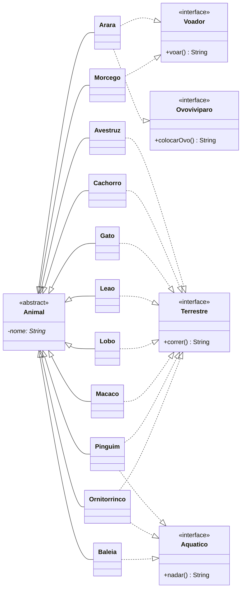

```mermaid
classDiagram
    direction LR
    
    class Animal {
        <<abstract>>
        -nome: String*
    }
    
    class Arara {}
    class Avestruz {}
    class Baleia {}
    class Cachorro {}
    class Gato {}
    class Leao {}
    class Lobo {}
    class Macaco {}
    class Morcego {}
    class Pinguim {}
    class Ornitorrinco {}
    
    class Terrestre {
        <<interface>>
        +correr() String
    }
    
    class Aquatico {
        <<interface>>
        +nadar() String
    }
    
    class Voador {
        <<interface>>
        +voar() String
    }
    
    class Ovoviviparo {
        <<interface>>
        +colocarOvo() String
    }
    
    Animal <|-- Arara
    Animal <|-- Avestruz
    Animal <|-- Baleia
    Animal <|-- Cachorro
    Animal <|-- Gato
    Animal <|-- Leao
    Animal <|-- Lobo
    Animal <|-- Macaco
    Animal <|-- Morcego
    Animal <|-- Pinguim
    Animal <|-- Ornitorrinco
    
    Avestruz ..|> Terrestre
    Cachorro ..|> Terrestre
    Gato ..|> Terrestre
    Leao ..|> Terrestre
    Lobo ..|> Terrestre
    Macaco ..|> Terrestre
    Pinguim ..|> Terrestre
    Ornitorrinco ..|> Terrestre
    
    
    Pinguim ..|> Aquatico
    Ornitorrinco ..|> Aquatico
    Baleia ..|> Aquatico
    
    Arara ..|> Voador
    Morcego ..|> Voador
    
    Arara ..|> Ovoviviparo
```