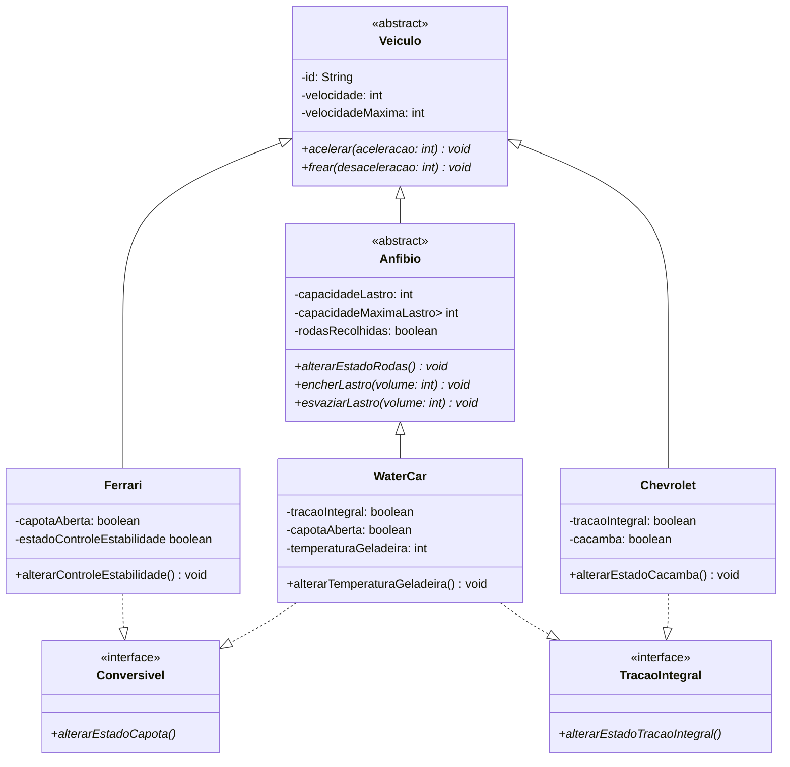

```mermaid
classDiagram
    
    direction TB
    
    class Veiculo {
        <<abstract>>
        -id: String
        -velocidade: int
        -velocidadeMaxima: int
        +acelerar(aceleracao: int) void *
        +frear(desaceleracao: int) void *
    }
    
    class Anfibio {
        <<abstract>>
        -capacidadeLastro: int
        -capacidadeMaximaLastro> int
        -rodasRecolhidas: boolean
        +alterarEstadoRodas() void *
        +encherLastro(volume: int) void *
        +esvaziarLastro(volume: int) void *
    }
    
    class Conversivel {
        <<interface>>
        +alterarEstadoCapota() *
    }
    
    class TracaoIntegral {
        <<interface>>
        +alterarEstadoTracaoIntegral()*
    }
    
    class Ferrari {
        -capotaAberta: boolean
        -estadoControleEstabilidade boolean
        +alterarControleEstabilidade() void
    }
    
    class Chevrolet {
        -tracaoIntegral: boolean
        -cacamba: boolean
        +alterarEstadoCacamba() void
    }
    
    class WaterCar {
        -tracaoIntegral: boolean
        -capotaAberta: boolean
        -temperaturaGeladeira: int
        +alterarTemperaturaGeladeira() void
    }
    
    Veiculo <|-- Anfibio
    
    Veiculo <|-- Ferrari
    Veiculo <|-- Chevrolet
    Anfibio <|-- WaterCar

    WaterCar ..|> Conversivel
    Ferrari ..|> Conversivel
    
    Chevrolet ..|> TracaoIntegral
    WaterCar ..|> TracaoIntegral
    

```